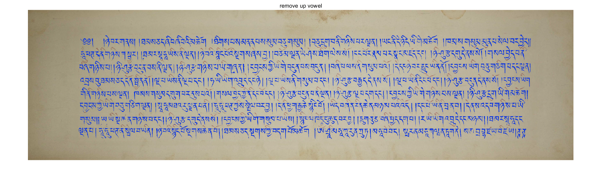

# This is a Tibetan document line segmenation
## The Tibetan Image 


## The Binary image


## The baseline image

##The baseline line in the origin image


##The baseline line in the origin image


##The up vowel label in the origin image


##The up vowel label in the origin image


## code run
please run the main.m with matlab

the result will be showed in the figure window
-----------------------------------------------------------------------------------
<br>
Markdown 插入代码块：
    ```matlab
     
    
        3: 3 %  image_nums 
    ```

 3: 3 %  image_nums 
 
 The code in the line eight can be modified as 1: image_nums, it will segment all image in the non_borderImage folder