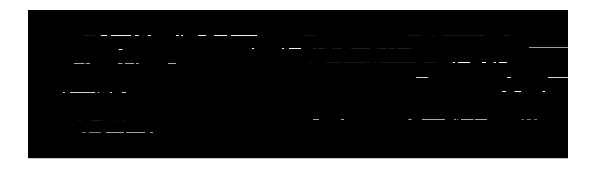
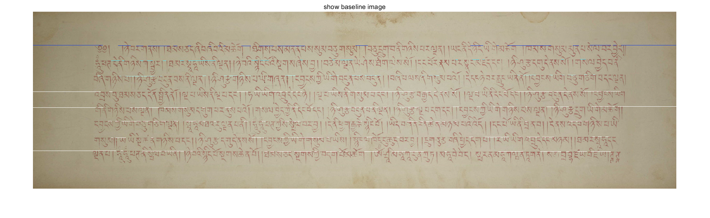
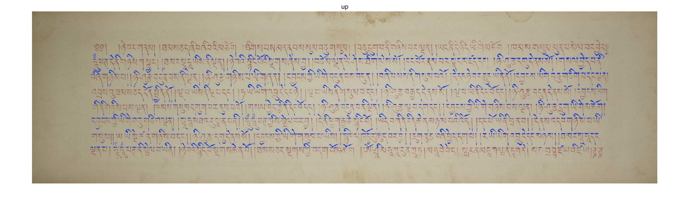

# This is a Tibetan document line segmenation
## The Tibetan Image 

## The Binary image

## The baseline image

##The baseline line in the origin image

##The baseline line in the origin image

##The up vowel label in the origin image
